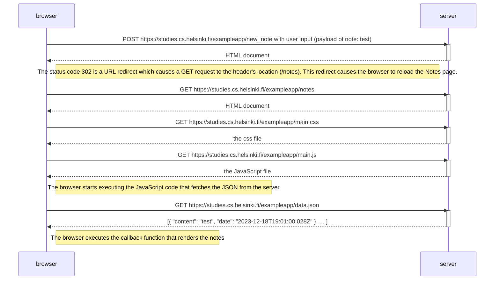

```mermaid
sequenceDiagram
  participant browser
  participant server

  browser->>server: POST https://studies.cs.helsinki.fi/exampleapp/new_note with user input (payload of note: test)
  activate server
  server-->>browser: HTML document
  deactivate server

  Note right of browser: The status code 302 is a URL redirect which causes a GET request to the header's location (/notes). This redirect causes the browser to reload the Notes page.

  browser->>server: GET https://studies.cs.helsinki.fi/exampleapp/notes
  activate server
  server-->>browser: HTML document
  deactivate server

  browser->>server: GET https://studies.cs.helsinki.fi/exampleapp/main.css
  activate server
  server-->>browser: the css file
  deactivate server

  browser->>server: GET https://studies.cs.helsinki.fi/exampleapp/main.js
  activate server
  server-->>browser: the JavaScript file
  deactivate server

  Note right of browser: The browser starts executing the JavaScript code that fetches the JSON from the server

  browser->>server: GET https://studies.cs.helsinki.fi/exampleapp/data.json
  activate server
  server-->>browser: [{ "content": "test", "date": "2023-12-18T19:01:00.028Z" }, ... ]
  deactivate server

  Note right of browser: The browser executes the callback function that renders the notes
```