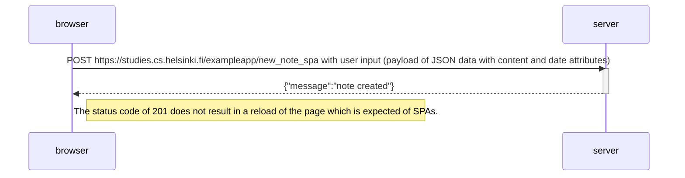

```mermaid
sequenceDiagram
  participant browser
  participant server

  browser->>server: POST https://studies.cs.helsinki.fi/exampleapp/new_note_spa with user input (payload of JSON data with content and date attributes)
  activate server
  server-->>browser: {"message":"note created"}
  deactivate server

  Note right of browser: The status code of 201 does not result in a reload of the page which is expected of SPAs.
```